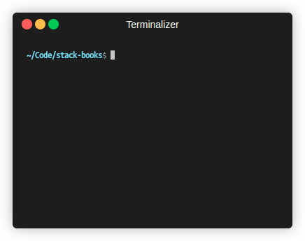

# Stack Books




> Simple game made in Node.js where you have to group books of the same color in stacks on your terminal.

## Features

- Interactive command-line interface
- Support for multiple stacks and colors
- Validation for moves and game state

The project is still under development and the next updates will focus on the following tasks:

- [X] Add command line arguments to set number of books and stacks
- [X] Add colors to the books
- [ ] Make the game more resilient to invalid inputs
- [ ] Make the game more resilient to invalid moves

## 💻 Prerequisites

Before you begin, ensure you have met the following requirements:

- You have installed `<Node.js / npm / yarn / outro>`.

## ☕ Playing Stack Books

To play Stack Books, follow these steps:

```bash
npx play-stack-books
```

In case you want to play defining the number of books and stacks, you can do it like this:

```bash
npx play-stack-books --color 6 --max-height 5
```

## 📝 License

This project is licensed under the MIT License. See the [LICENSE](LICENSE.md) file for more details.
